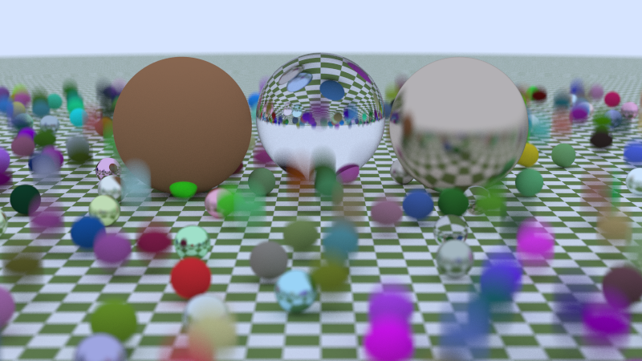

# Path Tracer

This is my path tracer implemented under the architecture of [Ray Tracing in One Weekend Series v3.2.3](https://raytracing.github.io/),

with features:

- geometric primitives: box, sphere, triangle, rectangle...
- materials: Cook Torrance PBR lighting model (diffuse\glossy\specular), dielectric...
- fog & smoke (constant density)
- physical camera: depth of field, motion blur
- multiple importance sampling
- bounding volume hierarchy
- multi-thread accelerated rendering with OpenMP

# Sample Images




# Build

Clone this repo and enter the directory, then run:

```bash
mkdir build
cd build
cmake ..
make
```

To render sample images, run:

```bash
PathTracer cornell_box > cornell_box.ppm
```

Note that to enable OpenMP, modify CmakeLists.txt to include the flag `-fopenmp` for gcc, or `/openmp` for MSVC.
